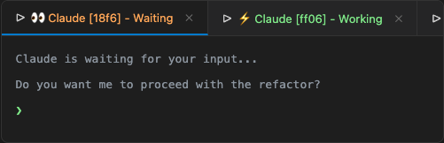
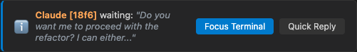
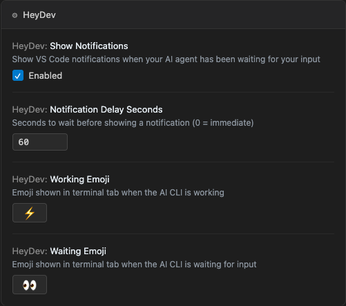

# HeyDev

> Hey dev, your AI is waiting for you.

A VS Code extension that shows real-time status indicators for AI CLI sessions (like Claude Code) in your terminal tabs, with smart notifications that bring you back when the AI is waiting for input.

## The Problem

When running multiple AI CLI sessions in VS Code, you constantly switch between terminals to check if the agent is done working or waiting for your input. There's no visual indicator in the terminal tab, and no way to know which session needs attention.

## The Solution

HeyDev adds live status indicators to your terminal tabs and sends smart VS Code notifications when your AI agent has been waiting for you.

## Features

### Terminal Tab Status

Each AI terminal tab shows its current state with a unique session tag:



- **⚡ Claude [a1b2] - Working** — The AI agent is actively using tools
- **👀 Claude [a1b2] - Waiting** — The AI agent is waiting for your input

The 4-character tag (`a1b2`) uniquely identifies each session, so you can tell multiple terminals apart at a glance.

### Smart Notifications

When the AI agent has been waiting for your input, a VS Code notification appears with context about what it's asking:



- **Focus Terminal** — Instantly switches to the correct terminal
- **Quick Reply** — Opens an input box to send a response (e.g., "yes", "no", "continue") without switching terminals

Notifications are smart:
- Show a snippet of the AI's last message so you know what it's asking
- Only fire after a configurable delay (default: 60 seconds)
- Cancelled if the AI starts working again before the delay
- Cancelled if you manually switch to the terminal
- Suppressed if the terminal is already focused
- **Instance-aware** — only fire in the VS Code window that owns the terminal (no cross-window spillover)
- **Startup-safe** — existing state files are consumed silently on launch (no notification flood)
- **Ghost-proof** — dead session files are auto-cleaned via PID liveness checks

### Configurable Settings

Customize emojis, notification timing, and more:



### Status Bar

The VS Code status bar shows the state of the currently focused AI terminal session.

## Supported Tools

- **Claude Code** — Fully supported via hooks
- **OpenAI Codex CLI** — Fully supported via hooks
- **Copilot, Aider** — Planned for future releases

## Installation

### Quick Setup (Recommended)

1. Install **HeyDev** from the [VS Code Marketplace](https://marketplace.visualstudio.com/items?itemName=salilmonga.heydev)
2. Install **jq** if you don't have it: `brew install jq` (macOS) or [download](https://jqlang.github.io/jq/download/)
3. Open VS Code → `Cmd+Shift+P` → **"HeyDev: Setup Claude Code Integration"**
4. Restart your AI CLI sessions

That's it. The setup command automatically:
- Creates the hook script
- Configures Claude Code hooks (preserving your existing hooks)
- Detects and configures Codex CLI hooks if installed
- Disables Claude's built-in title management
- Creates the state directory

### Uninstalling

**Important:** Run this before uninstalling the extension from VS Code.

1. `Cmd+Shift+P` → **"HeyDev: Remove All Hooks (Claude, Codex)"**
2. This removes all hooks from Claude and Codex, cleans up env vars, scripts, and offers to revert VS Code settings
3. Then uninstall the extension from the Extensions panel

> VS Code doesn't support auto-cleanup on extension uninstall, so step 1 is required to remove hooks cleanly.

### Building from Source

```bash
git clone https://github.com/SalilMonga/HeyDev.git
cd HeyDev
npm install
npm run compile
npx @vscode/vsce package --allow-missing-repository
code --install-extension heydev-0.3.4.vsix
```

## Settings

Configure via VS Code Settings (`Cmd+,`) → search "HeyDev":

| Setting | Default | Description |
|---------|---------|-------------|
| `heydev.showNotifications` | `true` | Enable/disable VS Code notifications |
| `heydev.notificationDelaySeconds` | `60` | Seconds to wait before notifying (0 = immediate) |
| `heydev.workingEmoji` | `⚡` | Emoji for the "working" state in terminal tabs |
| `heydev.waitingEmoji` | `👀` | Emoji for the "waiting" state in terminal tabs |
| `heydev.stateDirectory` | *(auto)* | Override state file directory |

Emoji changes sync automatically to the hook script — no manual editing needed.

## How It Works

```
AI CLI (Claude Code / Codex)
  ↓ (hooks fire on state changes)
Hook Script (~/.claude/scripts/heydev-hook.sh <state> <tool>)
  ↓ writes state file          ↓ sets terminal title
  ~/.claude/terminal-status/    Terminal tab: ⚡ Codex [a1b2] - Working
  ↓ (fs.watch)
VS Code Extension (HeyDev)
  ↓ maps session → terminal via PID
  ↓ sends notifications
  VS Code notification: "[a1b2] waiting: "what should I do next?""
    → [Focus Terminal] [Quick Reply]
```

1. **Hooks** fire on AI CLI events (tool use, stop, user prompt)
2. **Hook script** writes a JSON state file and sets the terminal title (tool-agnostic — works with Claude, Codex, etc.)
3. **HeyDev extension** watches the state directory for changes
4. **PID matching** maps each state file to the correct VS Code terminal
5. **PID liveness** verifies the session process is still alive — dead session files are cleaned up automatically
6. **Ownership check** ensures notifications only fire in the VS Code instance that owns the terminal
7. **Notifications** appear after the configured delay with actions to focus or quick-reply

## Compatibility

- **VS Code** 1.85+
- **macOS** (tested), Linux (should work), Windows (untested)
- **Claude Code CLI** or **OpenAI Codex CLI** with hooks support
- **Terminal**: Works in VS Code's integrated terminal

## License

MIT
